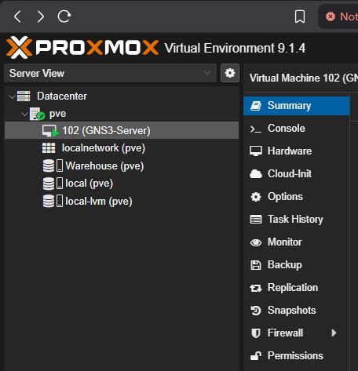

# Enterprise Hybrid-Cloud Network Engineering Lab 🏗️

## 1. The Mission
I am building a scalable, enterprise-grade lab environment to simulate complex network topologies and test advanced cybersecurity concepts. 

To overcome the inherent compute and memory bottlenecks of local Type-2 hypervisors (VirtualBox/VMware), I engineered a centralized, remote-compute infrastructure utilizing a bare-metal Type-1 hypervisor. This allows me to run massive routing tables and dense Virtual Network Functions (VNFs) with zero strain on the local client.

---

## 2. The Architecture & Stack
* **Server Hardware:** Bare-metal x86 architecture.
* **Hypervisor:** Proxmox VE (Type-1).
* **Compute Engine:** GNS3 Server (Remote Node VM).
* **Virtual Network Functions:** MikroTik Cloud Hosted Router (CHR) v7.16, Cisco IOS/IOU.
* **Endpoints:** Network Automation Docker containers (Alpine/Ubuntu) for lightweight footprint testing.

---

## 3. The 5-Phase Deployment & Engineering Log

### Phase 1: Bare-Metal Hypervisor Provisioning
* Wiped the host desktop machine and flashed Proxmox VE.
* Configured the Linux networking stack, binding the physical NIC to a virtual bridge (`vmbr0`).
* Established a static IP assignment (`10.0.10.190`) via `/etc/network/interfaces` to ensure persistent out-of-band management access.


### Phase 2: Compute Engine Orchestration (Resource Allocation)
* Deployed the GNS3 Server as an isolated Virtual Machine (ID: 100) within Proxmox.
* Sized the VM to **20GB RAM and 4 vCPUs**, optimizing the host-to-guest resource ratio.
* Enabled Kernel Samepage Merging (KSM) to deduplicate memory pages across identical VNFs, drastically increasing node capacity.


*Figure 1: The Proxmox Server dashboard showing the 20GB RAM allocation.*

### Phase 3: Edge Security & Connectivity Routing
* **Challenge:** The local client could not reach the server on custom API ports.
* **Resolution:** Identified Windows Defender/Host Firewall silently dropping custom private-network TCP ports. Reconfigured host security groups to whitelist port 3081 traffic explicitly to the `10.0.10.0/24` subnet.

### Phase 4: API Synchronization & Version Control (Critical Fix)
* **Challenge:** The local GNS3 client (v2.2.55) repeatedly threw `Connection Refused` and `401 Unauthorized` errors when handshaking with the server. Modern Python `pip` environments enforce strict build isolation, breaking the legacy GNS3 v2.2 compilation tools.


*Figure 2: The critical Python version mismatch error that halted deployment.*

* **The Engineering Fix:** Executed a surgical downgrade of the server environment via CLI, injected legacy dependencies (`setuptools==59.6.0`), and bypassed build isolation to force compatibility.
  ```bash
  sudo systemctl stop gns3-server
  sudo pip3 install setuptools==59.6.0 wheel
  sudo pip3 uninstall gns3-server -y
  sudo pip3 install gns3-server==2.2.55
  sudo systemctl restart gns3-server
