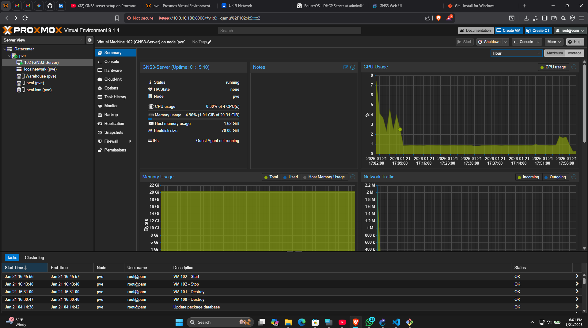
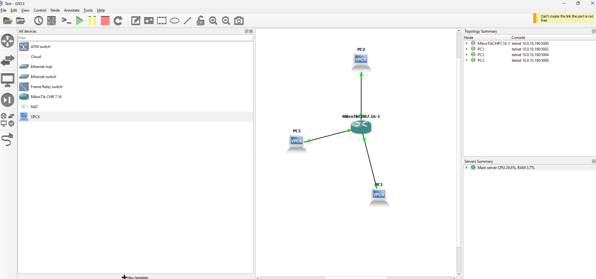
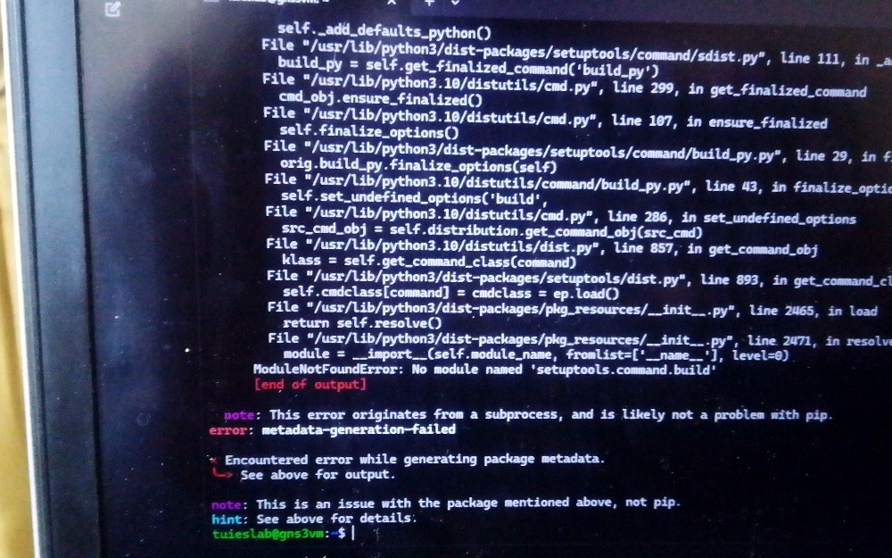

# Enterprise Hybrid-Cloud Network Automation Lab 🏗️

## Executive Summary
This repository documents the architecture, deployment, and troubleshooting of a self-hosted, high-performance network engineering laboratory. 

To overcome the inherent compute and memory bottlenecks of local Type-2 hypervisors (VirtualBox/VMware Workstation), I engineered a centralized, remote-compute infrastructure utilizing a bare-metal Type-1 hypervisor. This environment is designed to simulate large-scale, enterprise-grade network topologies (OSPF, BGP, IPsec VPNs) and validate network security concepts with zero resource strain on the local client machine.

## Architecture & Technology Stack

**Infrastructure Level:**
* **Hardware:** Bare-metal x86 architecture.
* **Hypervisor:** Proxmox Virtual Environment (Type-1).
* **Resource Optimization:** Kernel Samepage Merging (KSM) enabled to deduplicate memory pages across identical Virtual Network Functions (VNFs).

**Orchestration & Application Level:**
* **Compute Engine:** GNS3 Server (Remote Node VM) - Allocated 20GB RAM / 4 vCPUs.
* **Client Interface:** GNS3 Client GUI running locally, communicating via API over TCP port 3081.

**Virtual Network Functions (VNFs) & Containers:**
* **Routing:** MikroTik Cloud Hosted Router (CHR) v7.16, Cisco IOS/IOU.
* **Switching:** Layer 2/Layer 3 managed switch instances.
* **Endpoints:** Network Automation Docker containers (Alpine/Ubuntu base) for footprint-optimized testing (Ping, Nmap, Python, SSH).

---

## IP Addressing Scheme & Static Configuration
A robust lab requires predictable, static routing to ensure persistent Out-of-Band (OOB) management and stable API handshakes.
* **Hypervisor (Proxmox OOB):** Bound physical NIC to `vmbr0` with static IP `10.0.10.190/24`. Headless management verified via `ssh root@10.0.10.190`.
* **Compute Engine (GNS3 Server):** Reached internally via `ssh gns3@10.0.10.190` (Port 22).
* **Internal Lab Gateway (MikroTik):** Provisioned via CLI to act as the internal lab's first-hop gateway:
  `/ip address add address=192.168.1.1/24 interface=ether2`

---

## Deployment Phases

### Phase 1: Bare-Metal Hypervisor Provisioning
1. Wiped host machine and flashed Proxmox VE.
2. Configured the Linux networking stack, binding the physical NIC to a virtual bridge (`vmbr0`).
3. Established a static IP assignment (`10.0.10.190`) via the host's `/etc/network/interfaces` to ensure persistent out-of-band management access.
(Screenshots/prox.jpeg)
### Phase 2: Remote Compute Engine Initialization
1. Deployed the GNS3 Server as an isolated Virtual Machine (ID: 100) within Proxmox.
2. Sized the VM to **20GB RAM and 4 vCPUs**, optimizing the host-to-guest resource ratio.

3. Purged heavy GUI-based operating systems (Windows/Kali) from the hypervisor storage to dedicate 100% of compute and disk I/O to network packet processing and lightweight Docker containers.

### Phase 3: VNF Integration
1. Manually imported and configured raw disk images (`.img`) for MikroTik CHR.
2. Deployed Docker-based network automation clients to serve as lightweight test endpoints, consuming <50MB RAM each compared to 2GB+ for full OS VMs.


---

## Engineering Challenges & Resolutions

Building this infrastructure required deep-level troubleshooting of Linux packages, Python dependencies, and client-server API handshakes.

### 1. The Protocol Version Mismatch & API Failure
* **The Issue:** The local GNS3 client (v2.2.55) repeatedly threw `Connection Refused` and `401 Unauthorized` errors when attempting to handshake with the Proxmox GNS3 VM. 

* **Root Cause Analysis:** The automated server script pulled the bleeding-edge GNS3 v3.0.5 release. The v3 API protocol is fundamentally incompatible with the v2.2.55 client architecture.
* **The Fix:** Executed a surgical downgrade of the server environment via CLI without destroying the VM.
  ```bash
  sudo systemctl stop gns3-server
  sudo pip3 uninstall gns3-server -y
  sudo pip3 install gns3-server==2.2.55
  sudo systemctl restart gns3-server
